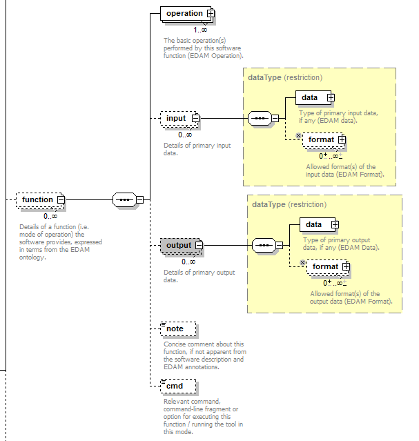

Curators Guide
==============

.. attention::
   - guidelines for `bio.agents <https://bio.agents>`_  curators, including EDAM annotation guidelines. 
   - to make suggestions about these guidelines please add comments via `GitHub <https://github.com/bio-agents/bioagentsDocs/issues/6>`_
   - for curation advice mail `registry-support <mailto:registry-support@iechor-dk.org>`_

  
*bio.agents* includes all types of bioinformatics *agents* - application software with well-defined data processing functions (inputs, outputs and operations).  This ranges from simple agents with a single primary function, to complex, multimodal agents with many disinct functions.  Agents may be available for immediate use as online services, or in a form which you can download, install, configure and run yourself.

Usually, a *bio.agents* entry describes a discrete agent.  Some entries describe *collections* of agents, such as software suites.  The scope, *i.e.* the types of agents that may be included, and the attributes for their description, are defined in `bioagentsSchema <https://github.com/bio-agents/bioagentsschema>`_ which uses the `EDAM ontology <https://github.com/edamontology/edamontology/>`_ as a source of terms for the agent scientific description.  These curation guidelines describe how to create a high quality agent description, above and beyond the syntactic and semantic constraints that are defined in bioagentsSchema and EDAM.

- `general guidelines <http://bioagents.readthedocs.io/en/latest/curators_guide.html#general-guidelines>`_ include basic considerations, annotation of `agent functions <http://bioagents.readthedocs.io/en/latest/curators_guide.html#agentfunctions>`_ and the use of `EDAM <http://bioagents.readthedocs.io/en/latest/curators_guide.html#edamannotations>`_.  You should read these first of all.
- guidelines on `specific attributes <http://bioagents.readthedocs.io/en/latest/curators_guide.html#summary>`_ defined in the `bioagentsSchema <https://github.com/bio-agents/bioagentsschema>`_ 
- guidelines specific to individual `types of agents <http://bioagents.readthedocs.io/en/latest/curators_guide.html#guidelines-per-agent-type>`_

The key words "MUST", "MUST NOT", "REQUIRED", "SHALL", "SHALL NOT", "SHOULD", "SHOULD NOT", "RECOMMENDED",  "MAY", and "OPTIONAL" in this document are to be interpreted as described in `RFC 2119 <http://www.ietf.org/rfc/rfc2119.txt>`_:

- **"MUST"**, **"REQUIRED"** or **"SHALL"** mean that the guideline is an absolute requirement of the specification.
- **"MUST NOT"** or **"SHALL NOT"** mean that the guideline is an absolute prohibition of the specification.
- **"SHOULD"** or **"RECOMMENDED"** mean that there may exist valid reasons in particular circumstances to ignore a particular guideline, but the full implications must be understood and carefully weighed before doing so.
- **"SHOULD NOT"** or the phrase **"NOT RECOMMENDED"** mean that there may exist valid reasons in particular circumstances when acting contrary to the geuideline is acceptable or even useful, but the full implications should be understood and the case carefully weighed before doing so.
- **"MAY** or **"OPTIONAL"** mean that the guideline is truly optional; you can choose to follow it or not.
    
.. note::
   
   The guidelines are a key component of an emerging `information standard <http://bioagentsschema.readthedocs.io/en/latest/information_requirement.html>`_ for agents being adopted by *bio.agents*, as a basis to monitor content and label *bio.agents* entries.

   - **automatically verified** guidelines are (or will be) checked *via* automated periodic QC of the *bio.agents* system
   - **manually verified** guidelines are checked *via* manual QC performed by trusted curators (*bio.agents* admin, entry owners *etc.*)
   - advice given in boxes (notes, tips, caution *etc.* are not verified

.. _generalguidelines:

General guidelines
------------------

Before you start
^^^^^^^^^^^^^^^^
Consider the following *before* creating a *bio.agents* entry:

1. **Are one or more entries required to describe the software?**

   - `workbenches <http://bioagents.readthedocs.io/en/latest/curators_guide.html#workbench>`_ and other `suites <http://bioagents.readthedocs.io/en/latest/curators_guide.html#suite>`_ often require multiple entries.
   - agents with multiple interfaces (*e.g.* `Command-line agent <http://bioagents.readthedocs.io/en/latest/curators_guide.html#command-line-agent>`_ , `Web API <http://bioagents.readthedocs.io/en/latest/curators_guide.html#web-api>`_, `Web service <http://bioagents.readthedocs.io/en/latest/curators_guide.html#web-service>`_ and `Web application <http://bioagents.readthedocs.io/en/latest/curators_guide.html#web-application>`_) **SHOULD** be described by a single entry **unless** these interfaces provide fundamental functional differences (see `Agent functions <http://bioagents.readthedocs.io/en/latest/curators_guide.html#agentfunctions>`_ below).
   - if in doubt, mail `registry-support <mailto:registry-support@iechor-dk.org>`_.

2. **What agent types apply?**

   - one or more agent `types <http://bioagents.readthedocs.io/en/latest/curators_guide.html#agent-type>`_ may be assigned in a single entry reflecting different facets of the software described by the entry.
   - read the agent type-specific `guidelines <http://bioagents.readthedocs.io/en/latest/curators_guide.html#guidelines-per-agent-type>`_ before you create the agent.

     
3. **What if the software is already registered?** 

   - if you're the rightful owner of the entry (*i.e.* the agent developer or provider of an online service) then request ownership of it
   - otherwise, request edit rights 

   Make these requests using the buttons at the bottom of the Agent Card (see *e.g.* https://bio.agents/signalp).

   If you plan to register multiple entries *en masse*, please discuss this first with `bio.agents admin <mailto:registry-support@iechor-dk.org>`_.  
     
4. **Are there version-specific considerations?**

   - as a rule, a *bio.agents* entry **SHOULD** describe the *latest version* available at the time of registration and **SHOULD** be updated, as required, for subsequent releases.
   - if a new version has fundamental functional differences (see `Agent functions <http://bioagents.readthedocs.io/en/latest/curators_guide.html#agentfunctions>`_ below) it **MAY** be registered as an entirely new entry.  In such cases, follow carefully the guidelines for agent `name <http://bioagents.readthedocs.io/en/latest/curators_guide.html#name>`_ and `version <http://bioagents.readthedocs.io/en/latest/curators_guide.html#version>`_ annotations.

5. **Plan** how to describe the `agent functions <http://bioagents.readthedocs.io/en/latest/curators_guide.html#agent-functions>`_.
6. **Read** the general `EDAM annotations guidelines <http://bioagents.readthedocs.io/en/latest/curators_guide.html#edam-annotation-guidelines>`_.

.. _agentfunctions:
   
Agent functions 
^^^^^^^^^^^^^^^
*bio.agents* uses a model of software (see below) defined within `bioagentsSchema <https://github.com/bio-agents/bioagentsschema>`_.  A agent can have one or more basic functions (modes of operation), each function performing one or more specific operation (e.g."Sequence alignment"), and may have one or more primary inputs and outputs, each of a defined type of data and listing supported format(s).

  

Plan how how to describe the software:

- identify the distinct functions (modes of operation) and the individual operations associated with each one.  Typically different functions (modes) perform different operations and for well documented agents, this is usually obvious.  If in any doubt mail `registry-support <mailto:registry-support@iechor-dk.org>`_.
- as a general rule, if the agent allows an option between doing one thing or another, then you **MUST** annotate the operations as distinct functions.  If in contrast a agent always does one or more things, then you **MUST** annotate these as distinct operations within a single function.
- *bio.agents* aims for fairly coarse-grained description, *i.e.* you **SHOULD** only specify the primary functions and operations, from a typical end-user perspective.  If a agent happens to perform some operation internally, but this is secondary to its advertised purpose, then you **SHOULD NOT** annotate it.  If in doubt mail `registry-support <mailto:registry-support@iechor-dk.org>`_
- this holds for input and output too, *e.g.* a sequence alignment agent would be annotated as reading sequences (input), and writing a sequence alignment (output), but not with gap insertion and extension penalties, or other parameters.
- many agents allow a primary input or output to be specified in a number of alternative ways, *e.g.* a sequence input that may be specified *via* a sequence identifier, or as a literal sequence.  In such cases, you **MAY** annotate the alternatives as distinct functions (see above).  If specifying just one alternative, you **SHOULD** use the EDAM Data concept for the type of data, rather than identifier.  

.. note::
   A future refactoring may improve the modelling for alternative specification of inputs and outputs, by allowing multiple data+format couplets for a given input or output.  If this is done, the proposed guideline would be: 

   - you **MAY** annotate all the commonly used alternatives and, if specifying alternatives, **MUST** annotate these as distinct data + format couplets within a single input or output.
   - many inputs and outputs are complex, with individual data files containining multiple types of data.  You **MUST** select the single EDAM Data term that best describes an input or output (see `EDAM annotations <http://bioagents.readthedocs.io/en/latest/curators_guide.html#edam-annotations>`_ below) and **MUST NOT** specify multiple EDAM Data terms describing differents facets of the data.

   Input on this issue is welcomed via `GitHub <https://github.com/bio-agents/bioagentsSchema/issues/83>`_.

.. _edamannotations:
   
EDAM annotations
^^^^^^^^^^^^^^^^
The `EDAM ontology <http://edamontologydocs.readthedocs.io/en/latest/>`_ is used to annotate applicable `topics <http://bioagents.readthedocs.io/en/latest/curators_guide.html#topic>`_, `operations <http://bioagents.readthedocs.io/en/latest/curators_guide.html#operation>`_, and the `type <http://bioagents.readthedocs.io/en/latest/curators_guide.html#data-type-input-and-output-data>`_ and `format <http://bioagents.readthedocs.io/en/latest/curators_guide.html#data-format-input-and-output-data>`_ of inputs and outputs. The general guidelines below apply for all EDAM annotations.

- **1.** **MUST NOT** use "organisational" EDAM concepts *e.g.* Topic of "Topic" or Operation of "Operation" (see note below)
- **2.** **SHOULD** use the most specific term(s) available, bearing in mind some concepts are necessarily overlapping or general.  If multiple sibling terms are applicable (*i.e.* terms under a common parent), the parent term may be applicable.
- **3.** **SHOULD NOT** use both a term and it's parent or other ancestor, when annotating a single attribute.  An exception would be a agent which *e.g.* performs some general `Sequence analysis <http://edamontology.org/operation_2403>`_ operations but specialises on `Protein feature detection <http://edamontology.org/operation_3092>`_.

.. tip::
   If you're struggling to find the terms you need, or the meaning of a term is not obvious, search EDAM using the browsers below (they have different functionalities).  Multiple searches using synonyms, alternative spellings *etc.* can help.

   - `EBI OLS browser <http://www.ebi.ac.uk/ols/ontologies/edam>`_
   - `NCBO BioPortal browser <https://bioportal.bioontology.org/ontologies/EDAM>`_
   - `EDAM ontology browser from IFB <https://ifb-iechorfr.github.io/edam-browser/>`_
   - `EDAM Agent Annotator Demo <http://people.binf.ku.dk/vzn529/eta/>`_
   

   If you cannot find the right term, request it’s added to EDAM via `GitHub <https://github.com/edamontology/edamontology/issues/new>`_ but first read the guidelines on `how to request a term <http://edamontologydocs.readthedocs.io/en/latest/contributors_guide.html#requests>`_.
     
.. note::
   It currently takes some time from requesting new EDAM terms for these to be supported in *bio.agents*.  In future, you'll be able to request terms directly via the *bio.agents* registration interface and these terms will become immediately available for use, albeit subject to approval and possible change before inclusion in EDAM and *bio.agents*.

.. note::
   Some high-level "organisational" concepts defined in EDAM are intended primarily to structure the hierarchy, and are not intended for annotation in *bio.agents*. They are defined in `EDAM.owl <https://github.com/edamontology/edamontology/blob/master/EDAM_dev.owl>`_ via ``<usageGuideline>Not recommended for annotation in bio.agents.</usageGuideline>`.  Such tips are visible in the OLS and BioPortal browsers.
      
   

Attribute guidelines
--------------------

.. attention::
Guidelines below are organised into sections as they appear in the `bio.agents <https://bio.agents>`_ registration user interface
 
Summary group
^^^^^^^^^^^^^
*Basic information about the software.*

Name (agent)
...........
*Canonical software name assigned by the software developer or service provider, e.g. "needle"*

- **1.** **MUST** use name in common use, *e.g.* in the agent homepage and publication.
- **2.** **MUST** use short form if available *e.g.* ``ExPASy`` **not** ``ExPASy Bioinformatics Resource Portal``.
- **3.** **MUST NOT** include general or technical terms ("software", "application", "server", "service", "SOAP", "REST", "RESTful" *etc.*) *unless* these are part of the common name
- **4.** **MUST NOT** misappropriate the names of other agents, *e.g.* there are many online BLAST services besides the original NCBI BLAST agent; calling any of them "BLAST" would be wrong
- **5.** **MUST NOT** include version or status information including terms like "alpha", "beta" *etc.* - *unless* this is part of common name
- **6.** **SHOULD** preserve capitalisation *e.g.* ``ExPASy`` **not** ``expasy``.
- **7.** **SHOULD** follow the naming patterns (see below)

.. note::
   - see the `syntax guidelines <http://bioagents.readthedocs.io/en/latest/api_usage_guide.html#name>`_.
  
.. note::  **Naming patterns**

   For `database portals <http://bioagents.readthedocs.io/en/latest/curators_guide.html#database-portal>`_ use the pattern:

     ``name (acronym)`` *e.g.* ``The Protein Databank (PDB)``

   - a common abbreviation can be given instead of an acronym
   - if no common acronym or abbreviation exists, omit this part: do not invent one!
     
   For agents that simply wrap or provide an interface to some other agent, including `Web APIs <http://bioagents.readthedocs.io/en/latest/curators_guide.html#webapi>`_ (REST), `Web services <http://bioagents.readthedocs.io/en/latest/curators_guide.html#webservice>`_ (SOAP+WSDL), and `web applications <http://bioagents.readthedocs.io/en/latest/curators_guide.html#webapplication>`_ over command-line agents, use the pattern:

     ``{collectionName} agentName {API|WS}{( providerName)}`` *e.g.* ``EMBOSS water API (ebi)``

   where:
  
   * ``collectionName`` is the name of suite, workbench or other collection the underlying agent is from (if applicable)
   * ``agentName`` is the `canonical name <http://bioagents.readthedocs.io/en/latest/curators_guide.html#name-agent>`_ of the underlying agent
   * use ``API`` for Web APIs or ``WS`` for Web services
   * ``providerName`` is the name of the institute providing the online service (if applicable)

   If in exceptional cases (*i.e.* when registering, as separate entries, `versions <http://bioagents.readthedocs.io/en/latest/curators_guide.html#agent-versions>`_ of a agent with `fundamental differences <http://bioagents.readthedocs.io/en/latest/curators_guide.html#before-you-start>`_), substitute for ``agentName`` in the pattern above:
   
     ``agentname versionID`` *e.g.* ``FindPeaks 3.1``

   where ``versionID`` is the version number.
   
.. tip::
   - in case of mulitple related entries be consistent, *e.g.* ``Open PHACTS`` and ``Open PHACTS API``
   - be wary of names that are very long (>25 characters). If shortening the name is necessary, don't truncate it in a way (*e.g.* within the middle of a word) that would render it meaningless or unintuitive

     

Description
...........
*Textual description of the software, e.g. "needle reads two input sequences and writes their optimal global sequence alignment to file. It uses the Needleman-Wunsch alignment algorithm to find the optimum alignment (including gaps) of two sequences along their entire length. The algorithm uses a dynamic programming method to ensure the alignment is optimum, by exploring all possible alignments and choosing the best."*

- **1.** **MUST** provide a concise summary of purpose / function of the agent
- **2.** **MUST** begin with a capital letter and end with a period ('.') 
- **3.** **SHOULD NOT** include any of the following, *unless* essential to distinguish the agent from other bio.agent entries:

  - provenance information *e.g.* software provider, institute or person name
  - describe how good the software is (mentions of applicability are OK)
    
- **4.** **SHOULD NOT** include URLs
- **5.** **SHOULD NOT** include DOIs  

.. note::
   - see the `syntax guidelines <http://bioagents.readthedocs.io/en/latest/api_usage_guide.html#description>`_.
  

Homepage
........
*Homepage of the software, or some URL that best serves this purpose, e.g. "http://emboss.open-bio.org/rel/rel6/apps/needle.html"*

- **1.** **MUST** resolve to a web page from the developer / provider that most specifically describes the agent
- **2.** **SHOULD NOT** specify an FTP site unless nothing else is available.
- **3.** **MAY** specify a repository if no better alternative is available.
  
.. note::
   - see the `syntax guidelines <http://bioagents.readthedocs.io/en/latest/api_usage_guide.html#homepage>`_.  
  
.. tip:: In case a agent lacks it's own website, a URL of it's code repository is OK. Do not use a general URL such as an institutional homepage, unless nothing better is available.

Version (agent)
..............
*Version information (typically a version number) of the software applicable to this bio.agents entry, e.g. "6.4.0.0"*

- **1.** **MUST** correctly identify the agent version as described by the other attributes (see note below)
- **2.** **MUST** specify exactly the public version label in common use
- **3.** **MUST NOT** include tokens such as "v", "ver", "version", "rel", "release" *etc.*, *unless* these are part of the public version label
- **4.** **MAY** identify all agent versions which are applicable to the entry
- **5.** **MAY** specify a version for database portals and web applications, but only if this is used in the common `name <http://bioagents.readthedocs.io/en/latest/curators_guide.html#name>`_

.. note::
   - see the `syntax guidelines <http://bioagents.readthedocs.io/en/latest/api_usage_guide.html#version>`_.  

.. important::
   Care is needed to ensure annotations correspond to the indicated agent version.
     - **only** change the version if you're sure there's no fundamental change to the specified agent `functions <http://bioagents.readthedocs.io/en/latest/curators_guide.html#function>`_ (operations, inputs and outputs)
     - if there are fundamental changes, update the agent `function <http://bioagents.readthedocs.io/en/latest/curators_guide.html#function>`_ annotation
     - **do not** assume version "1" in case the version number is not readily findable

.. tip::
   One or more version fields may be specified, and each - in princple - allows flexible specification of version information including single versions, ranges, lists and lists including ranges, *e.g.*:

   - 1.1
   - beta01
   - 2.0 - 2.7
   - 1.1, 1.2.1, 1.4, v5
   - 1.1 - 1.4, 2.0-alpha, 2.0-beta-01 - 2.0-beta-04, 2.0.0
   - *etc.*

   We recommend to keep things simple (one version label per field by default) and pragmatic (using version ranges where desirable).
       

Other IDs
.........
*A unique identifier of the software, typically assigned by an ID-assignment authority other than bio.agents, e.g. "RRID:SCR_015644"*

- **1.** **MUST** correctly identify the same agent as indicated by the `bioagentsID <http://bioagents.readthedocs.io/en/latest/curators_guide.html#bioagentsid>`_
- **2.** **MUST** include version information if IDs for multiple different versions are specified
- **3.** **MAY** specify the type of identifier (see below)

.. csv-table::
   :header: "Type", "Description"
   :widths: 25, 100

   "doi", "Digital Object Identifier of the software assigned (typically) by the software developer or service provider."
   "rrid", "Research Resource Identifier as used by the NIH-supported Resource Identification Portal (https://scicrunch.org/resources)."
   "cpe", "Common Platform Enumeration (CPE) identifier as listed in the CPE dictionary (https://cpe.mitre.org/dictionary/)."
   "bioagentsCURIE", "bio.agents CURIE (secondary identifier)."
   
.. note::
   - see the `syntax guidelines <http://bioagents.readthedocs.io/en/latest/api_usage_guide.html#other-ids>`_.

.. attention::
   Alternative IDs of type ``bioagentsCURIE`` are set (and can only be changed) by *bio.agents* admin. They allow *bio.agents* to support multiple `bioagentsIDs <http://bioagents.readthedocs.io/en/latest/curators_guide.html#bioagentsid>`_ (hence resolvable Agent Card URLs) for a single agent; this done in exceptional circumstances only, *e.g.* the name of a agent is changed.

     
Value
~~~~~
*Value of agent identifier, e.g. "RRID:SCR_001156"*

- **1.** **MUST** specify a valid identifier for the agent.

Type (otherID)
~~~~~~~~~~~~~~
*Type of agent identifier, e.g. "rrid"*

- **1.** **MAY** specify the applicable type, in terms from a controlled vocabulary (see below) - although this should not normally be necessary

Version (otherID)
~~~~~~~~~~~~~~~~~
*Version information (typically a version number) of the software applicable to this identifier, e.g. "1.4"*

- **1.** **MUST** correctly identify the applicable agent version 
- **2.** **MUST** follow the general guidelines for `version <http://bioagents.readthedocs.io/en/latest/curators_guide.html#version-agent>`_

Function group
^^^^^^^^^^^^^^
*Details of a function (i.e. mode of operation) the software provides, expressed in concepts from the EDAM ontology.*

Operation
.........
*The basic operation(s) performed by this software function (EDAM Operation), e.g. "'Protein signal peptide detection' (http://edamontology.org/operation_0418)"*

- **1.** **MUST** correctly specify operations performed by the agent, or (if `version <http://bioagents.readthedocs.io/en/latest/curators_guide.html#agent-versions>`_ is indicated), those specific version(s) of the agent
- **2.** **MUST** be correctly organised into multiple functions, in case the agent has multiple modes of operation (see guidelines for `agent functions <http://bioagents.readthedocs.io/en/latest/curators_guide.html#agentfunctions>`_).
- **3.** **SHOULD** describe all the primary operations performed by that agent and **SHOULD NOT** describe secondary / minor operations: if in any doubt, mail `registry-support <mailto:registry-support@iechor-dk.org>`_. 

.. attention::
   - see the `general guidelines for EDAM annotations <http://bioagents.readthedocs.io/en/latest/curators_guide.html#edamannotations>`_.

.. note::
   - see the `syntax guidelines <http://bioagents.readthedocs.io/en/latest/api_usage_guide.html#operation>`_.
     
  
     
Data type (input and output data)
.................................
*Type of primary input / output data (if any) e.g. "'Sequence' (http://edamontology.org/data_2044)"*

- **1.** **MUST** correctly specify types of input or output data processed by the agent, or (if `version <http://bioagents.readthedocs.io/en/latest/curators_guide.html#agent-versions>`_ is indicated), those specific version(s) of the agent
- **2.** **MUST** be correctly associated with the operation(s); for each function in case the agent has multiple modes of operation (see guidelines for `agent functions <http://bioagents.readthedocs.io/en/latest/curators_guide.html#agentfunctions>`_).
- **3.** **SHOULD** describe all the primary inputs and outputs of the agent and **SHOULD NOT** describe secondary / minor inputs and outputs: if in any doubt, mail `registry-support <mailto:registry-support@iechor-dk.org>`_. 

.. attention::
   - see the `general guidelines for EDAM annotations <http://bioagents.readthedocs.io/en/latest/curators_guide.html#edamannotations>`_.

.. tip::
   - many agents allow a primary input to be specified in a number of alternative ways, the common case being a sequence input that may be specified via a sequence identifier, or by typing in a literal sequence.  In such cases, annotate the input using the EDAM Data concept for the type of data, not the identifier.

.. note::
   - see the syntax guidelines for `input <http://bioagents.readthedocs.io/en/latest/api_usage_guide.html#input>`_ and `output <http://bioagents.readthedocs.io/en/latest/api_usage_guide.html#output>`_
  

     
     
Data format (input and output data)
...................................
*Allowed format(s) of primary inputs/outputs e.g. "'FASTA' (http://edamontology.org/format_1929)"*

- **1.** **MUST** correctly specify data formats supported on input or output by the agent, or (if `version <http://bioagents.readthedocs.io/en/latest/curators_guide.html#agent-versions>`_) is indicated, those specific version(s) of the agent
- **2.** **MUST** be correctly associated with the data type of an input or output (see guidelines for `agent functions <http://bioagents.readthedocs.io/en/latest/curators_guide.html#agentfunctions>`_).
- **3.** **SHOULD** describe the primary data formats and **MAY** exhaustively describe *all* formats: if in any doubt, mail `registry-support <mailto:registry-support@iechor-dk.org>`_. 

.. attention:: see the `general guidelines for EDAM annotations <http://bioagents.readthedocs.io/en/latest/curators_guide.html#edamannotations>`_.

.. note::
   - see the `syntax guidelines <http://bioagents.readthedocs.io/en/latest/api_usage_guide.html#format>`_.
       
    
Note (function)
...............
*Concise comment about this function, if not apparent from the software description and EDAM annotations, e.g. "This option is slower, but more precise.*"

- **1.** **MUST** not duplicate what is already apparent from the EDAM annotations
- **2.** **SHOULD** be concise and summarise only critical usage information
- **3.** **SHOULD NOT** duplicate online documentation; give a link if necessary

.. note::
   - see the `syntax guidelines <http://bioagents.readthedocs.io/en/latest/api_usage_guide.html#operation>`_.

Command
.......
*Relevant command, command-line fragment or option for executing this function / running the agent in this mode, e.g "-s best"*

- **1.** **MUST** specify precisely a command, command-line fragment or option specified in the agent documentation
- **2.** **MUST** be correctly associated with a function (the command must be used to invoke that specific agent function)

.. note::
   - see the `syntax guidelines <http://bioagents.readthedocs.io/en/latest/api_usage_guide.html#operation>`_.
     
     
Labels group
^^^^^^^^^^^^
*Miscellaneous scientific, technical and administrative details of the software, expressed in terms from controlled vocabularies.*

Agent type
.........
*The type of application software: a discrete software entity can have more than one type, e.g. "Command-line agent, Web application"*

- **1.** **MUST** specify all types that are applicable, in terms from a controlled vocabulary (see below)

.. csv-table::
   :header: "Type", "Description"
   :widths: 25, 100

   "Bioinformatics portal", " web site providing a platform/portal to multiple resources used for research in a focused area, including biological databases, web applications, training resources and so on."	    
   "Command-line agent", "A agent with a text-based (command-line) interface."
   "Database portal", "A Web application, suite or workbench providing a portal to a biological database."
   "Desktop application", "A agent with a graphical user interface that runs on your desktop environment, *e.g.* on a PC or mobile device."
   "Library", "A collection of components that are used to construct other agents.  bio.agents scope includes component libraries performing high-level bioinformatics functions but excludes lower-level programming libraries."
   "Ontology", "A collection of information about concepts, including terms, synonyms, descriptions etc."
   "Plug-in", "A software component encapsulating a set of related functions, which are not standalone, *i.e.* depend upon other software for its use, *e.g.* a Javascript widget, or a plug-in, extension add-on etc. that extends the function of some existing agent."
   "Script", "A agent written for some run-time environment (*e.g.* other applications or an OS shell) that automates the execution of tasks. Often a small program written in a general-purpose languages (*e.g.* Perl, Python) or some domain-specific languages (*e.g.* sed)."
   "SPARQL endpoint", "A service that provides queries over an RDF knowledge base via the SPARQL query language and protocol, and returns results via HTTP."
   "Suite", "A collection of agents which are bundled together into a convenient agentkit.  Such agents typically share related functionality, a common user interface and can exchange data conveniently.  This includes collections of stand-alone command-line agents, or Web applications within a common portal."
   "Web application", "A agent with a graphical user interface that runs in your Web browser."
   "Web API", "An application programming interface (API) consisting of endpoints to a request-response message system accessible via HTTP.  Includes everything from simple data-access URLs to RESTful APIs."
   "Web service", "An API described in a machine readable form (typically WSDL) providing programmatic access via SOAP over HTTP."
   "Workbench", "An application or suite with a graphical user interface, providing an integrated environment for data analysis which includes or may be extended with any number of functions or agents.  Includes workflow systems, platforms, frameworks etc."
   "Workflow", "A set of agents which have been composed together into a pipeline of some sort.  Such agents are (typically) standalone, but are composed for convenience, for instance for batch execution via some workflow engine or script."

.. tip::
   - in cases where a given software is described by more than one entry (*e.g.* a web application and its API are described separately) then assign only the types that are applicable to that entry.
  
.. note::
   - *bio.agents* includes all types of bioinformatics agents: application software with well-defined data processing functions (inputs, outputs and operations). When registering a agent, one or more agent types may be assigned, reflecting the different facets of the software being described.
   - see the `syntax guidelines <http://bioagents.readthedocs.io/en/latest/api_usage_guide.html#agent-type>`_.     

Topic
.....
*General scientific domain the software serves or other general category (EDAM Topic), e.g. "'Protein sites, features and motifs' (http://edamontology.org/topic_3510)"*

- **1.** **MUST** specify the single most important and relevant scientific topic
- **2.** **MAY** specify all highly relevant scientific topics
- **3.** **SHOULD NOT** exhaustively specify all the topics of lower or secondary relevance

.. attention::
   - see the `general guidelines for EDAM annotations <http://bioagents.readthedocs.io/en/latest/curators_guide.html#edamannotations>`_.
  
.. note::
   - see the `syntax guidelines <http://bioagents.readthedocs.io/en/latest/api_usage_guide.html#topic>`_.

Operating system
................
*The operating system supported by a downloadable software package, e.g. "Linux"*

- **1.** **MUST** specify all operating systems that are applicable, in terms from a controlled vocabulary (see below)

.. csv-table::
   :header: "Operating system", "Description"
   :widths: 25, 100

   "Linux", "All flavours of Linux/UNIX operating systems."
   "Windows", "All flavours of Microsoft Windows operating system."
   "Mac", "All flavours of Apple Macintosh operating systems (primarily Mac OS X)."
     
.. note::
   - see the `syntax guidelines <http://bioagents.readthedocs.io/en/latest/api_usage_guide.html#operating-system>`_.

Programming language
....................
*Name of programming language the software source code was written in, e.g. "C"*

- **1.** **MUST** specify the primary language used, in terms from a controlled vocabulary (see below)
- **2.** **MAY** exhaustively specify other languages used

.. csv-table::
   :header: "Programming language"
   :widths: 25

   "ActionScript"
   "Ada"
   "AppleScript"
   "Assembly language"
   "AWK"
   "Bash"
   "C"
   "C#"
   "C++"
   "COBOL"
   "ColdFusion"
   "CWL"
   "D"
   "Delphi"
   "Dylan"
   "Eiffel"
   "Forth"
   "Fortran"
   "Groovy"
   "Haskell"
   "Icarus"
   "Java"
   "JavaScript"
   "JSP"
   "LabVIEW"
   "Lisp"
   "Lua"
   "Maple"
   "Mathematica"
   "MATLAB"
   "MLXTRAN"
   "NMTRAN"
   "OCaml"
   "Pascal"
   "Perl"
   "PHP"
   "Prolog"
   "PyMOL"
   "Python"
   "R"
   "Racket"
   "REXX"
   "Ruby"
   "SAS"
   "Scala"
   "Scheme"
   "Shell"
   "Smalltalk"
   "SQL"
   "Turing"
   "Verilog"
   "VHDL"
   "Visual Basic"
   "XAML"
   "Other"

.. note::
  - see the `syntax guidelines <http://bioagents.readthedocs.io/en/latest/api_usage_guide.html#programming-language>`_.

    
  
License
.......
*Software or data usage license, e.g. "GPL-3.0"*

- **1.** **MUST** acurately describe the license used.
- **2.** **SHOULD** use "Proprietary" in cases where the software is under license (not defined in bioagentsSchema) whereby it can be obtained from the provider (*e.g.* for money), and then owned, *i.e.* definitely not an open-source or free software license.
- **3.** **SHOULD** use "Freeware" for software that is available for use at no monetary cost. In other words, freeware may be used without payment but may usually not be modified, re-distributed or reverse-engineered without the author's permission.
- **4.** **SHOULD** use "Not licensed" for software which is not licensed and is not "Proprietary".
- **5.** **SHOULD** use "Other" if the software is available under a license not listed by bioagentsSchema and which is not "Proprietary".
  
  .. note::
  - a controlled vocabulary of valid terms is defined in `bioagentsSchema <https://github.com/bio-agents/bioagentsSchema/tree/master/stable>`_.
  - see the `syntax guidelines <http://bioagents.readthedocs.io/en/latest/api_usage_guide.html#license>`_.

.. tip::
   - Use the "Other" license for custom institutional licenses that are out of scope of `bioagentsSchema <https://github.com/bio-agents/bioagentsSchema/tree/master/stable>`_.  If you've found a license that you think should be included in bioagentsSchema please report it *via* `GitHub <https://github.com/bio-agents/bioagentsSchema/issues/new>`_.

.. note::
   Most permisible values are identifiers from the SPDX license list (https://spdx.org/licenses/). In future, based on the specified license a label (e.g. "Open-source") may be attached to the *bio.agents* entry (see table below)

   .. csv-table::  Labelling based on license (future work)
      :header: "License", "Description"
      :widths: 25, 100

      "Open-source", "Software is made available under a license approved by the Open Source Initiative (OSI). The software is distributed in a way that satisfies the 10 criteria of the Open Source Definition maintained by OSI (see https://opensource.org/docs/osd). The source code is available to others."
      "Free software", "Free as in 'freedom' not necessarily free of charge.  Software is made available under a license approved by the Free Software Foundation (FSF). The software satisfies the criteria of the Free Software Definition maintained by FSF (see http://www.gnu.org/philosophy/free-sw.html). The source code is available to others."
      "Free and open source", "Software is made available under a license approved by both the Open Source Initiative (OSI) and the Free Software Foundation (FSF), and satisfies the criteria of the OSI Open Source Definition maintained (https://opensource.org/docs/osd) and the FSF Free Software Definition (http://www.gnu.org/philosophy/free-sw.html).  Such software ensures users have the freedom to run, copy, distribute, study, change and improve the software.  The source code is available to others."
      "Copyleft", "Software is made available under a license designated as 'copyleft' by the Free Software Foundation (FSF).  The license ensures such software is free and that all modified and extended versions of the program are free as well. Free as in 'freedom' not necessarily free of charge, as per the Free Software Definition maintained by FSF (see http://www.gnu.org/philosophy/free-sw.html)."

     
Collection
..........
*Unique ID of a collection that the software has been assigned to within bio.agents, e.g. "CBS*

- **1.** **SHOUD** be short and intuitive

.. tip::
   - collections may be created for for any arbitrary purpose
     
.. note::
   - see the `syntax guidelines <http://bioagents.readthedocs.io/en/latest/api_usage_guide.html#collection>`_.
  

  
Maturity
........
*How mature the software product is, e.g. "Mature"*

- **1.** **MUST** acurately reflect the software maturity, in terms from a controlled vocabulary (see below)
  
.. csv-table::
   :header: "Maturity", "Description"
   :widths: 25, 100

   "Emerging", "Nascent or early release software that may not yet be fully featured or stable."
   "Mature", "Software that is generally considered to fulfill several of the following: secure, reliable, actively maintained, fully featured, proven in production environments, has an active community, and is described or cited in the scientific literature."
   "Legacy", "Software which is no longer in common use, deprecated by the provider, superseded by other software, replaced by a newer version, is obsolete etc."

.. attention::
   - normally only the developer or provider of a agent is sure of its maturity. If you are not sure, then do not complete this field.
		 
.. note::
   - see the `syntax guidelines <http://bioagents.readthedocs.io/en/latest/api_usage_guide.html#maturity>`_.

	    

   
Cost
....
*Monetary cost of acquiring the software, e.g. "Free of charge (with retritions)"*

- **1.** **MUST** acurately describe the monetary cost of acquiring the software, in terms from a controlled vocabulary (see below)

.. csv-table::
   :header: "Cost", "Description"
   :widths: 25, 100

   "Free of charge", "Software which available for use by all, with full functionality, at no monetary cost to the user."
   "Free of charge (with restrictions)", "Software which is available for use at no monetary cost to the user, but possibly with limited functionality, usage restrictions, or other limitations."
   "Commercial", "Software which you have to pay to access."

.. note::
   - see the `syntax guidelines <http://bioagents.readthedocs.io/en/latest/api_usage_guide.html#license>`_.

Accessibility
.............
*Whether there are non-monetary restrictions on accessing an online service., e.g. "Open access"*

- **1.** **MUST** acurately describe the accessibility conditions that apply, in terms from a controlled vocabulary (see below)

.. csv-table::
   :header: "Accessibility", "Description"
   :widths: 25, 100

   "Open access", "An online service which is available for use to all, but possibly requiring user accounts / authentication."
   "Open access (with restrictions)", "An online service which is available for use to all, but possibly with some usage limitations and other restrictions."
   "Restricted access", "An online service which is available for use to a restricted audience, e.g. members of a specific institute."

.. note::
   - see the `syntax guidelines <http://bioagents.readthedocs.io/en/latest/api_usage_guide.html#accessibility>`_.

IECHOR Platform
...............
*Name of the IECHOR Platform that is credited, e.g. "Agents"*

- **1.** **MUST** only credit the IECHOR Platform if directly contributing to the work, using a term from a controlled vocabulary (see below)

.. csv-table::
   :header: "IECHOR Platform", "Description"
   :widths: 25, 100
	    
   "Data", "IECHOR Data Platform"
   "Agents", "IECHOR Agents Platform"
   "Compute", "IECHOR Compute Platform"
   "Interoperability", "IECHOR Interoperability Platform"
   "Training", "IECHOR Training Platform"

IECHOR Node
...........
*Name of the IECHOR Node that is credited, e.g. "Norway"*

- **1.** **MUST** only credit the IECHOR Node if directly contributing to the work, using a term from a controlled vocabulary (see below)

.. csv-table::
   :header: "IECHOR Node"
   :widths: 25
	    
   "Belgium"
   "Czech Republic"
   "Denmark"
   "EMBL"
   "Estonia"
   "Finland"
   "France"
   "Germany"
   "Greece"
   "Hungary"
   "Ireland"
   "Israel"
   "Italy"
   "Luxembourg"
   "Netherlands"
   "Norway"
   "Portugal"
   "Slovenia"
   "Spain"
   "Sweden"
   "Switzerland"
   "UK"
     

IECHOR Community
................
*Name of relevant IECHOR (or associated) community, e.g. "Galaxy"*

- **1.** **MAY** cite any IECHOR Community to which the software is directly relevant.

.. csv-table::
   :header: "IECHOR Community"
   :widths: 25

   "3D-BioInfo"
   "Federated Human Data"
   "Galaxy"
   "Human Copy Number Variation"
   "Intrinsically Disordered Proteins"
   "Marine Metagenomics"
   "Metabolomics"
   "Microbial Biotechnology"
   "Plant Sciences"
   "Proteomics"
   "Rare Diseases"
   

Link group
^^^^^^^^^^^
*Miscellaneous links for the software e.g. repository, issue tracker or mailing list.*

.. note::
  - the *bio.agents* registration interace & API allows a curator to record when a link of a certain type is known to *not* be available
  - see the `syntax guidelines <http://bioagents.readthedocs.io/en/latest/api_usage_guide.html#link>`_.
   

URL (link)
..........
*A link of some relevance to the software (URL), e.g. "https://github.com/pharmbio/sciluigi/issues"*

- **1.** **MUST** resolve to a page of the indicated `link type <http://bioagents.readthedocs.io/en/latest/curators_guide.html#link-type>`_
- **2.** **MUST NOT** give a general link (*e.g.* homepage URL) if a more specific link is available  

.. _linktype:
     
Link type
.........
*The type of data, information or system that is obtained when the link is resolved, e.g. "Mailing list"*

- **1.** **MUST** acurately specify the type of information available at the link, in terms from a controlled vocabulary (see below)
- **2.** **MUST** use type "Other" if another, more specific type is not available  
- **3.** **SHOULD** specify all the types that are applicable

.. csv-table::
   :header: "Link type", "Description"
   :widths: 25, 100

   "Discussion forum", "Online forum for user discussions about the software."
   "Galaxy service", "An online service providing the agent through the Galaxy platform."
   "Helpdesk", "A phone line, web site or email-based system providing help to the end-user of the software."
   "Issue tracker", "Tracker for software issues, bug reports, feature requests etc."
   "Mailing list", "Mailing list for the software announcements, discussions, support etc."
   "Mirror", "Mirror of an (identical) online service."
   "Software catalogue", "Some registry, catalogue etc. other than bio.agents where the agent is also described."
   "Repository", "A place where source code, data and other files can be retrieved from, typically via platforms like GitHub which provide version control and other features, or something simpler, e.g. an FTP site."
   "Social media", "A website used by the software community including social networking sites, discussion and support fora, WIKIs etc."
   "Service", "An online service (other than Galaxy) that provides access (an interface) to the software."
   "Technical monitoring", "Information about the technical status of a agent."
   "Other", "Other type of link for software - the default if a more specific type is not available."
    
Note (link)
...........

*Comment about the link, e.g. "Please use the issue tracker for reporting bugs and making features requests."*

- **1.** **SHOULD** be a concise summary of practical information

Download group
^^^^^^^^^^^^^^
*Links to downloads for the software, e.g. source code, virtual machine image or container.*

.. note::
  - the *bio.agents* registration interace & API allows a curator to record when a documentation link of a certain type is known to *not* be available
  - see the `syntax guidelines <http://bioagents.readthedocs.io/en/latest/api_usage_guide.html#download>`_.

URL (download)
..............
*Link to download (or repo providing a download) for the software, e.g. "http://bioconductor/packages/release/bioc/src/contrib/VanillaICE_1.36.0.tar.gz"*

- **1.** **MUST** resolve to a page providing either an immediately download, or links for a download of the indicated `link type <http://bioagents.readthedocs.io/en/latest/curators_guide.html#download-type>`_
- **2.** **MUST NOT** give a general link (*e.g.* homepage URL) if a more specific link is available

  
Download type
.............
*Type of download that is linked to, e.g. "Binaries"*

- **1.** **MUST** acurately specify the type of download available at the link, in terms from a controlled vocabulary (see below)
- **2.** **MUST** use type "Other" if another, more specific type is not available
- **3.** **SHOULD** use type "Downloads page" for links to general downloads pages (*i.e.* one which includes details about multiple types of download)
  
.. csv-table::
   :header: "Download type", "Description"
   :widths: 25, 100

   "API specification", "File providing an API specification for the software, e.g. Swagger/OpenAPI, WSDL or RAML file."
   "Biological data", "Biological data, or a web page on a database portal where such data may be downloaded. "
   "Binaries", "Binaries for the software; compiled code that allow a program to be installed without having to compile the source code."
   "Command-line specification", "File providing a command line specification for the software."
   "Container file", "Container file including the software."
   "Icon", "Icon of the software."
   "Screenshot", "Screenshot of the software."
   "Source code", "The source code for the software, that can be compiled or assembled into an executable computer program."
   "Software package", "A software package; a bundle of files and information about those files, typically including source code and / or binaries."
   "Test data", "Data for testing the scientific performance of the software or whether it is working correctly."
   "Test script", "Script used for testing testing whether the software is working correctly."
   "Agent wrapper (CWL)", "Agent wrapper in Common Workflow Language (CWL) format for the software."
   "Agent wrapper (galaxy)", "Galaxy agent configuration file (wrapper) for the software."
   "Agent wrapper (taverna)", "Taverna configuration file for the software."
   "Agent wrapper (other)", "Workbench configuration file (other than taverna, galaxy or CWL wrapper) for the software."
   "VM image", "Virtual machine (VM) image for the software."
   "Downloads page", "Web page summarising general downloads available for the software."
   "Other", "Other type of download for software - the default if a more specific type is not available."

   
Note (download)
...............
*Comment about the download, e.g. "Complete distibution"*

- **1.** **SHOULD** be concise and summarise only practical information about the link

Version (download)
..................
*Version information (typically a version number) of the software applicable to this download.*

- **1.** **MUST** correctly identify the applicable agent version 
- **2.** **MUST** follow the general guidelines for `version <http://bioagents.readthedocs.io/en/latest/curators_guide.html#version-agent>`_

   
											
Documentation group
^^^^^^^^^^^^^^^^^^^
*Links to documentation about the software e.g. user manual, API documentation or training material.*

.. note::
  - the *bio.agents* registration interace & API allows a curator to record when a documentation link of a certain type is known to *not* be available
  - see the `syntax guidelines <http://bioagents.readthedocs.io/en/latest/api_usage_guide.html#documentation>`_.

URL (documentation)
...................
*Link to documentation on the web for the agent, e.g. "http://bioconductor.org/packages/release/bioc/html/VanillaICE.html"*

- **1.** **MUST** resolve to a page of the indicated `documentation type <http://bioagents.readthedocs.io/en/latest/curators_guide.html#documentation-type>`_
- **2.** **MUST NOT** give a general link (*e.g.* homepage URL) if a more specific link is available
  
.. _documentationtype:

Documentation type
..................
*Type of documentation that is linked to, e.g. "Citation instructions"*

- **1.** **MUST** acurately specify the type of documentation available at the link, in terms from a controlled vocabulary (see below)
- **2.** **MUST** use type "Other" if another, more specific type is not available
- **3.** **SHOULD** specify all the types that are applicable

.. csv-table::
   :header: "Documentation type", "Description"
   :widths: 25, 100
		
   "API documentation", "Human-readable API documentation."
   "Citation instructions", "Information on how to correctly cite use of the software; typically which publication(s) to cite, or something more general, e.g. a form of words to use."
   "Code of conduct", "A set of guidelines or rules outlining the norms, expectations, responsibilities and proper practice for individuals working within the software project."
   "Command-line options", "Information about the command-line interface to a agent."
   "Contributions policy", "Information about policy for making contributions to the software project."
   "FAQ", "Frequently Asked Questions (and answers) about the software."
   "General", "General documentation."
   "Governance", "Information about the software governance model."
   "Installation instructions", "Instructions how to install the software."
   "Quick start guide", "A short guide helping the end-user to use the software as soon as possible."
   "Release notes", "Notes about a software release or changes to the software; a change log."
   "Terms of use", "Rules that one must agree to abide by in order to use a service."
   "Training material", "Online training material such as a tutorial, a presentation, video etc."
   "User manual ", "Information on how to use the software, tailored to the end-user."
   "Other", "Some other type of documentation not listed in bioagentsSchema."

Note (documentation)
....................
*Comment about the documentation, e.g. "Comprehensive usage information suitable for biologist end-users."*

- **1.** **SHOULD** be concise and summarise only practical information about the link

Relation group
^^^^^^^^^^^^^^
*Details of a relationship this software shares with other software registered in bio.agents.*

- **1.** **MUST** correctly identify a relationship between two *bio.agents* entries
- **2.** **MUST NOT** not contradict a relationship that is already specified in *bio.agents*
- **3.** **MUST** specify a valid bioagentsID (of a agent that's registerd in *bio.agents*)
  
.. note::
   - see the `syntax guidelines <http://bioagents.readthedocs.io/en/latest/api_usage_guide.html#relation>`_.

bioagentsID (relation)
.....................
*bio.agents ID of an existing bio.agents entry to which this software is related, e.g. "needle"*

Relation type
.............
*Type of relation between this and another registered software, e.g. "isNewVersionOf"*

.. csv-table::
   :header: "Relation type", "Description"
   :widths: 25, 100

   "isNewVersionOf", "The software is a new version of an existing software, typically providing new or improved functionality."
   "hasNewVersion", "(inverse of above)"
   "uses", "The software provides an interface to or in some other way uses the functions of other software under the hood, e.g. invoking a command-line agent or calling a Web API, Web service or SPARQL endpoint to perform its function."
   "usedBy", "(inverse of above)"
   "includes", "A workbench, agentkit or workflow includes some other, independently available, software."
   "includedIn", "(inverse of above)"  
  
Publication group
^^^^^^^^^^^^^^^^^
*Publications about the software*

- **1.** **MUST** correctly identify a relevant publication
- **2.** **MUST** specify multiple IDs for a single publication within a single publication group
- **3.** **SHOULD** specify a DOI (if available) (in preference to PMID and PMCID)
- **4.** **MAY** specify one or more types that match the publication

.. note::
   - see the `syntax guidelines <http://bioagents.readthedocs.io/en/latest/api_usage_guide.html#publication>`_.

PubMed Central ID
.................
*PubMed Central Identifier (PMCID) of a publication about the software, e.g. "PMC4343077"*

PubMed ID
.........
*PubMed Identifier (PMID) of a publication about the software, e.g. "21959131"*

Digital Object ID
.................
*Digital Object Identifier (DOI) of a publication about the software, e.g. "10.1038/nmeth.1701"*

Publication type
................
*Type of publication, e.g. "Primary"*

- **1.** **MUST** acurately specify the type of publication, in terms from a controlled vocabulary (see below)
- **2.** **SHOULD** specify all the types that are applicable

.. csv-table::
   :header: "Publication type", "Description"
   :widths: 25, 100
	    
   "Primary", "The principal publication about the agent itself; the article to cite when acknowledging use of the agent."
   "Method", "A publication describing a scientific method or algorithm implemented by the agent."
   "Usage", "A publication describing the application of the agent to scientific research, a particular task or dataset."
   "Benchmarking study", "A publication which assessed the performance of the agent."
   "Review", "A publication where the agent was reviewed."
   "Other", "A publication of relevance to the agent but not fitting the other categories."

Note (publication)
.............
*A comment about the publication, e.g. "A comparison of the software to others performing a similar function."*

- **1.** **SHOULD** be concise and acurate, elaborating on the motivation, purpose *etc.* of the publication
- **2.** **SHOULD NOT** duplicate information that is, or can, be provided via the ``type`` or other attributes, *i.e.* do not specify "Review article", "Cite this where the software is used" *etc.*
   
Version (publication)
.....................
*Version information (typically a version number) of the software applicable to this publication.*

- **1.** **MUST** correctly identify the applicable agent version 
- **2.** **MUST** follow the general guidelines for `version <http://bioagents.readthedocs.io/en/latest/curators_guide.html#version-agent>`_
  
		
Credit group
^^^^^^^^^^^^
*Individuals or organisations that should be credited, or may be contacted about the software.*

- **1.** **SHOULD** provide contact details for the first port-of-call when seeking help with the software, and **SHOULD** annotate the role of this entity as "Primary contact"
- **2.** **MAY** specify one or more other credits

.. note::
   - a credit consists of the name, email and/or URL of some entity that is credited, with other associated metadata
   - see the `syntax guidelines <http://bioagents.readthedocs.io/en/latest/api_usage_guide.html#credit>`_.

     
Name (credit)
.............
*Name of the entity that is credited, e.g. "EMBL EBI"*

- **1.** **MUST** give the first and last names of a person, or the correct name of some other entity.
- **2.** **MUST NOT** give a redirect, *e.g.* "See publication", a URL, or any information other than the name of the entity that is credited.

ORCID ID
........
*Unique identifier (ORCID iD) of a person that is credited, e.g. "http://orcid.org/0000-0002-1825-0097"*

- **1.** **MUST** correctly identify a credited person

.. note::
   Open Researcher and Contributor IDs (ORCID IDs) provide a persistent reference to information on a researcher, see http://orcid.org/.

  
GRID ID
........
*Unique identifier (GRID ID) of an organisation that is credited, e.g. "grid.5170.3"*

- **1.** **MUST** correctly identify a credited organisation

.. note::
   Global Research Identifier Database IDs (GRID IDs) provide a persistent reference to information on an organisation, see https://www.grid.ac/.    

ROR ID
........
*Unique identifier (ROR ID) of an organisation that is credited, e.g. "03yrm5c26"*

- **1.** **MUST** correctly identify a credited organisation

.. note::
   Research Organization Registry (ROR) IDs provide a persistent reference to information on research organisations, see https://ror.org/.

FundRef ID
........
*Unique identifier (FundRef ID or Funder ID) of a funding organisation that is credited, e.g. "10.13039/100009273"*

- **1.** **MUST** correctly identify a credited organisation

.. note::
   The Funder Registry (formerly FundRef) IDs provide a persistent reference to information on funding organisations registered in the Crossref registry, see https://www.crossref.org/services/funder-registry/.

Email
.....
*Email address of the entity that is credited e.g. "hnielsen@cbs.dtu.dk"*

- **1.** **MUST** specify a syntactically valid email address  
- **2.** **MUST NOT** specify an email address that is not publicly acknowledged as credit for the software, *e.g.* on a webpage or in a publication
- **3.** **MUST NOT** specify a stale (obsolete) email address

URL (credit)
............
*URL for the entity that is credited, e.g. homepage of an institute, e.g. "http://www.ebi.ac.uk/"*

- **1.** **MUST** resolve to a page of information directly relevant to the credited entity

Entity type
...........
*Type of entity that is credited, e.g. "Person"*

- **1.** **MUST** acurately specify the type of entity that is credited, in terms from a controlled vocabulary (see below)

.. csv-table::
   :header: "Entity type", "Description"
   :widths: 25, 100

   "Person", "Credit of an individual."
   "Project", "Credit of a community software project not formally associated with any single institute."
   "Division", "Credit of or a formal part of an institutional organisation, e.g. a department, research group, team, etc"
   "Institute", "Credit of an organisation such as a university, hospital, research institute, service center, unit etc."
   "Consortium", "Credit of an association of two or more institutes or other legal entities which have joined forces for some common purpose.  Includes Research Infrastructures (RIs) such as IECHOR."
   "Funding agency", "Credit of a legal entity providing funding for development of the software or provision of an online service."

	    
Entity role
...........
*Role performed by entity that is credited, e.g. "Developer"*

- **1.** **MUST** acurately specify the primary role of credited entity, in terms from a controlled vocabulary (see below)
- **2.** **MAY** exhaustively specify all the roles of the credited entity

.. csv-table::
   :header: "Role", "Description"
   :widths: 25, 100
	    
   "Developer", "Author of the original software source code."
   "Maintainer", "Maintainer of a mature software providing packaging, patching, distribution etc."
   "Provider", "Institutional provider of an online service."
   "Documentor", "Author of software documentation including making edits to a bio.agents entry."
   "Contributor", "Some other role in software production or service delivery including design, deployment, system administration, evaluation, testing, documentation, training, user support etc."
   "Support", "Provider of support in using the software."
   "Primary contact", "The primary point of contact for the software."

Note (credit)
.............
*A comment about the credit, e.g. "Wrote the user manual."*

- **1.** **SHOULD** be concise and acurate, elaborating on the contribution of the credited entity
- **2.** **MUST NOT** duplicate information that is, or can, be provided via the ``role`` attribute, *i.e.* do not specify only "Developer", "Support" *etc.*
	       

Community group
^^^^^^^^^^^^
*Community and external partner resources linked from bio.agents.*

The community and external partner resources have their own custom properties in bio.agents to facilitate integration between bio.agents and other resource providers. 

If you're a resource provider and would like to integrate with bio.agents please email `registry-support@iechor-dk.org <registry-support@iechor-dk.org>`_ or `create an issue <https://github.com/bio-agents/bioagentsRegistry/issues/new>`_ on our `GitHub page <https://github.com/bio-agents/bioagentsRegistry/>`_.

BioLib Annotations (Community)
^^^^^^^^^^^^
*BioLib is a platform for biological data science applications. With BioLib apps, you can run bioinformatics agents directly in your web browser.* 

See more details at `https://biolib.com <https://biolib.com>`_.

- **1.** **MUST** specify a valid BioLib *App name*
- **2.** **MUST** specify a valid BioLib *Author username*
- **3.** **MUST** specify the *Author name*

App name (BioLib)
.............
*Application Name of an existing BioLib app, e.g. "MyBioAgent".*

Author username (BioLib)
.............
*BioLib Username of the user that created the BioLib app, e.g. "example-university"*

Author name (BioLib)
.............
*The display name of the author that created the BioLib app, e.g. "The Example University".*

  
Agent type guidelines
--------------------

Bioinformatics portal
^^^^^^^^^^^^^^^^^^^^^
**A web site providing a platform/portal to multiple resources used for research in a focused area, including biological databases, web applications, training resources and so on.**

- pick one or more `topics <http://bioagents.readthedocs.io/en/latest/curators_guide.html#topic>`_ that best describe the portal content. 
- consider carefully whether the portal will be described by a single, or more than one *bio.agents* entry (see `Before you start <http://bioagents.readthedocs.io/en/latest/curators_guide.html#before-you-start>`_).  Where the portal aggregates one or more discrete agents (web applications), databases *etc.*, it is recommended to register these as separate entries.  

.. _commandlineagent:

Command-line agent
^^^^^^^^^^^^^^^^^
**A agent with a text-based (command-line) interface.**

- carefully identify the major functions (modes of operation) performed by the agent (see `Agent functions <http://bioagents.readthedocs.io/en/latest/curators_guide.html#agentfunctions>`_) and annotate the major `operation(s) <http://bioagents.readthedocs.io/en/latest/curators_guide.html#operation>`_ associated with each function, in turn.
  

Database portal
^^^^^^^^^^^^^^^
**A Web application, suite or workbench providing a portal to a biological database.**

- pick one or more `topics <http://bioagents.readthedocs.io/en/latest/curators_guide.html#topic>`_ that best describe the database content. See also the specialised `Data management <http://edamontology.org/topic_3071>`_ concepts.
- consider carefully whether the database portal will be described by a single, or more than one *bio.agents* entry (see `Before you start <http://bioagents.readthedocs.io/en/latest/curators_guide.html#before-you-start>`_).  In case the portal contains one or more discrete agents (web applications), it is recommended to register these as separate entries.
- consider an operation of `Database search <http://edamontology.org/operation_2421>`_ (or its children)

Desktop application
^^^^^^^^^^^^^^^^^^^
**A agent with a graphical user interface that runs on your desktop environment, e.g. on a PC or mobile device.**

- desktop applications often have complex functionality: carefully identify the major functions (modes of operation) performed by the application (see `Agent functions <http://bioagents.readthedocs.io/en/latest/curators_guide.html#agentfunctions>`_) and annotate the major `operation(s) <http://bioagents.readthedocs.io/en/latest/curators_guide.html#operation>`_ associated with each function, in turn.
- consider an operation of `Visualisation <http://edamontology.org/operation_0337>`_ (or its children) - typical of desktop apps.
  
Library
^^^^^^^
**A collection of components that are used to construct other agents. bio.agents scope includes component libraries performing high-level bioinformatics functions but excludes lower-level programming libraries.**

- in case the library includes just a few components, each should (typically) be modelled as a distinct function (see `Agent functions <http://bioagents.readthedocs.io/en/latest/curators_guide.html#agentfunctions>`_); annotate the major `operation(s) <http://bioagents.readthedocs.io/en/latest/curators_guide.html#operation>`_ associated with each component (function) in turn.
- in case the library includes very many components, model the whole library as having a single function (see `Agent functions <http://bioagents.readthedocs.io/en/latest/curators_guide.html#agentfunctions>`_); and annotate only the major `operation(s) <http://bioagents.readthedocs.io/en/latest/curators_guide.html#operation>`_ (do not try to be exhaustive).
  
Ontology
^^^^^^^^
**A collection of information about concepts, including terms, synonyms, descriptions etc.**

- pick `Ontology and terminology <http://edamontology.org/topic_0089>`_ and one or more most relevant `topics <http://bioagents.readthedocs.io/en/latest/curators_guide.html#topic>`_ describing the scope of the ontology.
  
- do not annotate the function (operations, or type / format of the input and output data)
  
Plug-in
^^^^^^^
**A software component encapsulating a set of related functions, which are not standalone, *i.e.* depend upon other software for its use, e.g. a Javascript widget, or a plug-in, extension add-on etc. that extends the function of some existing agent.**

- when annotating the plug-in `function(s) <http://bioagents.readthedocs.io/en/latest/curators_guide.html#agentfunctions>`_, be careful to not duplicate the description of the agent which plug-in plugs into
- carefully identify the major new functions (modes of operation) which the plug-in provides, and annotate the major `operation(s) <http://bioagents.readthedocs.io/en/latest/curators_guide.html#operation>`_ associated with each function, in turn.
  
Script
^^^^^^
**A agent written for some run-time environment (e.g. other applications or an OS shell) that automates the execution of tasks. Often a small program written in a general-purpose languages (e.g. Perl, Python) or some domain-specific languages (e.g. sed).**

- scripts typically have a single function (mode of operation) (see `Agent functions <http://bioagents.readthedocs.io/en/latest/curators_guide.html#agentfunctions>`_), however, in case of complex scripts, carefully identify the major functions (modes of operation) performed by the script, and annotate the major `operation(s) <http://bioagents.readthedocs.io/en/latest/curators_guide.html#operation>`_ associated with each function, in turn.
  
- pick one or more most relevant `topics <http://bioagents.readthedocs.io/en/latest/curators_guide.html#topic>`_
  
SPARQL endpoint
^^^^^^^^^^^^^^^
**A service that provides queries over an RDF knowledge base via the SPARQL query language and protocol, and returns results via HTTP.**

- pick the `operation <http://bioagents.readthedocs.io/en/latest/curators_guide.html#operation>`_ of "Query and retrieval" (http://edamontology.org/operation_0224)
- do not annotate the type or format of the input and output data

Suite
^^^^^
**A collection of agents which are bundled together into a convenient agentkit. Such agents typically share related functionality, a common user interface and can exchange data conveniently. This includes collections of stand-alone command-line agents, or Web applications within a common portal.**

- pick one or more most relevant `topics <http://bioagents.readthedocs.io/en/latest/curators_guide.html#topic>`_ that describe the workbench as a whole (don't try to be exhaustive)
  
- describe the attributes that are commmon to the suite as a whole, not (typically) attributes of individual agents
- individual agents included in the suite should be registered as separate entries
- when annotating the `operation <http://bioagents.readthedocs.io/en/latest/curators_guide.html#operation>`_ of the suite, select operations that are core function of the suite itself / common to all agents in the suite.  Alternatively pick one or two of the primary operation(s) of the included agents
- entries for the suite itself and it's component agents can be associated by annotatong them as part of a common `collection <http://bioagents.readthedocs.io/en/latest/curators_guide.html#collection>`_

.. tip:: If you are considering to register a suite with many agents, it is a good idea to discuss this first with the `bio.agents admin <mailto:registry-support@iechor-dk.org>`_.
	 
.. attention:: **do not** annotate the `type <http://bioagents.readthedocs.io/en/latest/curators_guide.html#data-type-input-and-output-data>`_ and `format <>`_ of input and output data, *unless* all agents in the suite happen to have these in common

.. _webapplication:

Web application
^^^^^^^^^^^^^^^
**A agent with a graphical user interface that runs in your Web browser.**

- pick one or more most relevant `topics <http://bioagents.readthedocs.io/en/latest/curators_guide.html#topic>`_

.. note::
   - for software that essentially just wraps or provides an interface to some other agent, *e.g.* a web application or web service over an existing agent, use the pattern ``agentName providerName`` where ``providerName`` is a name (without spaces) of some institute, workbench, collection *etc.*, *e.g.* ``cufflinks cloudIFB``.  **Do not** misappropriate the original name!     

.. _webapi:

Web API
^^^^^^^
**An application programming interface (API) consisting of endpoints to a request-response message system accessible via HTTP. Includes everything from simple data-access URLs to RESTful APIs.**

- pick one or more most relevant `topics <http://bioagents.readthedocs.io/en/latest/curators_guide.html#topic>`_

- in general, describe the attributes of the API as a whole, not individual endpoint of the API (see note below)
- in case the API has a single endpoint only, the input(s), operation(s) and output(s) may be annotated
- in case the API has many endpoints, annotate the primary operation(s), but **not** the inputs and outputs
- annotate the location of machine-readable API specification (*e.g.* openAPI file) using the `download <http://bioagents.readthedocs.io/en/latest/curators_guide.html#download>`_ attribute with `download type <http://bioagents.readthedocs.io/en/latest/curators_guide.html#download-type>`_ of ``API specification``
  - annotate the location of any human-readable documentation using the `documentation <http://bioagents.readthedocs.io/en/latest/curators_guide.html#documentation>`_ attribute with `documentation type <http://bioagents.readthedocs.io/en/latest/curators_guide.html#download-type>`_ of ``API specification``
- when assigning the `name <http://bioagents.readthedocs.io/en/latest/curators_guide.html#name>`_, use the pattern ``name API`` *e.g.* ``Open PHACTS API``
- in case the web service provides an interface to an existing agent registered in *bio.agents*, try to ensure the relevant annotations are consistent

.. note::
   - `bioagentsSchema <https://github.com/bio-agents/bioagentsschema>`_ includes a basic model of an API specification including endpoints however this is not yet supported in *bio.agents*

.. _webservice:     
     
Web service
^^^^^^^^^^^
**An API described in a machine readable form (typically WSDL) providing programmatic access via SOAP over HTTP.**

- pick one or more most relevant `topics <http://bioagents.readthedocs.io/en/latest/curators_guide.html#topic>`_

  
- in general, describe the attributes of the web service as a whole, not individual endpoint of the service (see note below)
- in case the web service has a single endpoint only, the input(s), operation(s) and output(s) may be annotated
- in case the web service has many endpoints, annotate the primary operation(s), but **not** the inputs and outputs
- annotate the location of the WSDL file using the `download <http://bioagents.readthedocs.io/en/latest/curators_guide.html#download>`_ attribute with `download type <http://bioagents.readthedocs.io/en/latest/curators_guide.html#download-type>`_ of ``API specification``
- annotate the location of any human-readable documentation using the `documentation <http://bioagents.readthedocs.io/en/latest/curators_guide.html#documentation>`_ attribute with `documentation type <http://bioagents.readthedocs.io/en/latest/curators_guide.html#download-type>`_ of ``API specification``
- when assigning the `name <http://bioagents.readthedocs.io/en/latest/curators_guide.html#name>`_, use the pattern ``name WS`` *e.g.* ``EMMA WS``
- in case the web service provides an interface to an existing agent registered in *bio.agents*, try to ensure the relevant annotations are consistent

.. note::
   - `bioagentsSchema <https://github.com/bio-agents/bioagentsschema>`_ includes a basic model of an API specification including endpoints however this is not yet supported in *bio.agents*

Workbench
^^^^^^^^^
**An application or suite with a graphical user interface, providing an integrated environment for data analysis which includes or may be extended with any number of functions or agents. Includes workflow systems, platforms, frameworks etc.**

- pick one or more most relevant `topics <http://bioagents.readthedocs.io/en/latest/curators_guide.html#topic>`_ that best describe the workbench as a whole (don't try to be exhaustive)
  
- describe the attributes of the workbench as a whole, not (typically) individual agents or functions provided by it
- individual agents included in the workbench, especially where these agents are indepepdently available, should be registered as separate entries
- individual functions provided by the workbench, especially where these are not independently available, should each be described in their own `function <http://bioagents.readthedocs.io/en/latest/curators_guide.html#function>`_
- entries for the workbench itself and it's component agents can be associated by annotatong them as part of a common `collection <http://bioagents.readthedocs.io/en/latest/curators_guide.html#collection>`_

.. tip:: If you are considering to register a complicated workbench with many agents or functions, it is a good idea to discuss this first with the `*bio.agents* admin <mailto:registry-support@iechor-dk.org>`_.
	 

Workflow
^^^^^^^^
**A set of agents which have been composed together into a pipeline of some sort. Such agents are (typically) standalone, but are composed for convenience, for instance for batch execution via some workflow engine or script.**

- pick one or more most relevant `topics <http://bioagents.readthedocs.io/en/latest/curators_guide.html#topic>`_ that best describe the workflow as a whole (don't try to be exhaustive)
  
- when deciding how to annotate a workflow inputs, operations and outputs, consider the worfklow as a "black box" , *i.e.* annotate the input(s) to, output(s) from and primary operation(s) of the workflow as a whole
  
.. note::
   - `bio.agents <https://bio.agents>`_ does not currently contain many examples of workflows.  We welcome input on how to describe worfklows and ensure good coverage:  please `get in touch with us <mailto:registry@iechor-dk.org>`_.

.. important:: workflows can contain many agents; **do not** list all the operations performed by these agents, just the main operation(s) of the workflow as a whole.

Further guidelines (bio.agents admin only)
-----------------------------------------
.. attention::
   The guidelines that follow are for attributes and other aspects under the control of *bio.agents* admin.  If you're not a *bio.agents* admin you can ignore this section.

.. _bioagentsid:

summary->bioagentsID
^^^^^^^^^^^^^^^^^^^

*Unique ID (case insensitive) of the agent that is assigned upon registration of the software in bio.agents, normally identical to agent name, e.g. "needle".*

.. attention::
   - the ID by default is a URL-safe version of the agent name and can only be changed by *bio.agents* admin.  

- **MUST** use the default value where possible
- **MUST** be clean and intuitive (in case use of default is not possible) 
- **MUST NOT** truncate the name (in the middle of a word, or at all) if this renders the ID ugly or meaningless

.. note::
   **Transformation rules**
   
   The following rules apply when transforming the supplied agent name:

   - replace ' ' (spaces) in the name with underscores (a single underscore in case of multiple spaces)
   - preserve all reserved characters (uppercase and lowercase letters, decimal digits, hyphen, period, underscore, and tilde), but remove other characters
   - use '_' to delimit parts of names but only *if* these are not already truncated in the original `name <http://bioagents.readthedocs.io/en/latest/curators_guide.html#name-agent>`_
   - can only start with letters or numbers
   - cannot end with a . (dot) character
   - adhere to the same patterns for `agent name <http://bioagents.readthedocs.io/en/latest/curators_guide.html#name>`_, *e.g.* ``EMBOSS_water_API_ebi``

     
summary->bioagentsCURIE
^^^^^^^^^^^^^^^^^^^^^^
*bio.agents CURIE (compact URI) based on the unique bio.agents ID of the agent, e.g. "bioagents:needle"*
     
.. note::

   - identical to bioagentsID but with the prefix ``bioagents:``

credit->iechorNode
^^^^^^^^^^^^^^^^^^
*IECHOR node credited for developing or providing the software - the software is in Node Service Delivery Plan, e.g. "Denmark"*

- **1.** **MUST** acurately specify an IECHOR Node that is credited, in terms from a `controlled vocabulary <https://bioagentsschema.readthedocs.io/en/latest/controlled_vocabularies.html#iechor-node>`_
- **2.** **MUST** only be credited on agents that are in a Node's Service Delivery Plan.
- **3.** **MUST** only be set by a an IECHOR Node manager or IECHOR Hub.

credit->iechorPlatform
^^^^^^^^^^^^^^^^^^^^^^
*IECHOR platform credited for developing or providing the software, e.g. "Agents"*

- **1.** **MUST** acurately specify an IECHOR Platform that is credited, in terms from a `controlled vocabulary <https://bioagentsschema.readthedocs.io/en/latest/controlled_vocabularies.html#iechor-platform>`_
- **2.** **MUST** only be set by a an IECHOR Node manager or IECHOR Hub.  
     

